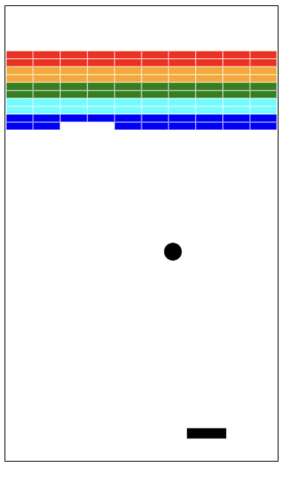
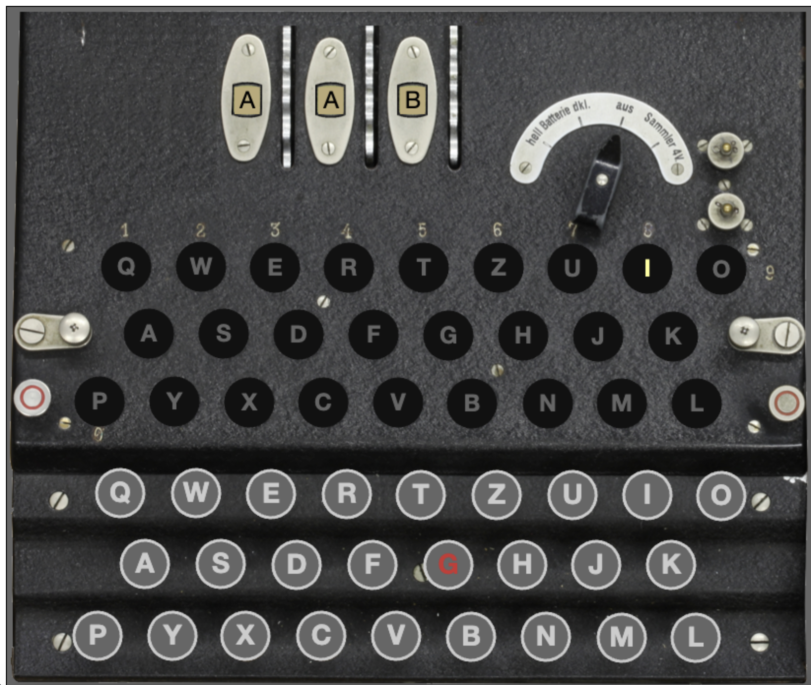

# Course Projects List
This repository contains projects that demonstrate my programming expertise ranging from classic games to cryptographic systems.
## 1. Adventure Game
## 2. Breakout Game
- Arcade-style Breakout game where the player uses a paddle to control the movement of a ball and hit bricks
- Player is allowed three tries
- Player wins when all bricks are hit with the ball

 

  

## 3. Enigma Machine
- An implementation of the Enigma machine, a cipher device used during World War II. The simulation encrypts and decrypts messages, making it difficult to crack codes

 

 

## 4. Flutterer
- Social network that mirrors the design of Twitter using client (JavaScript) and server (Python) programming
- Home page displays floots ("tweets") made by the user and their friends and allows for communication between floots

 

  

## 5. Generate Random Sentences
## 6. Match the Flag
## 7. Reassemble Fragments
## 8. Wordle

