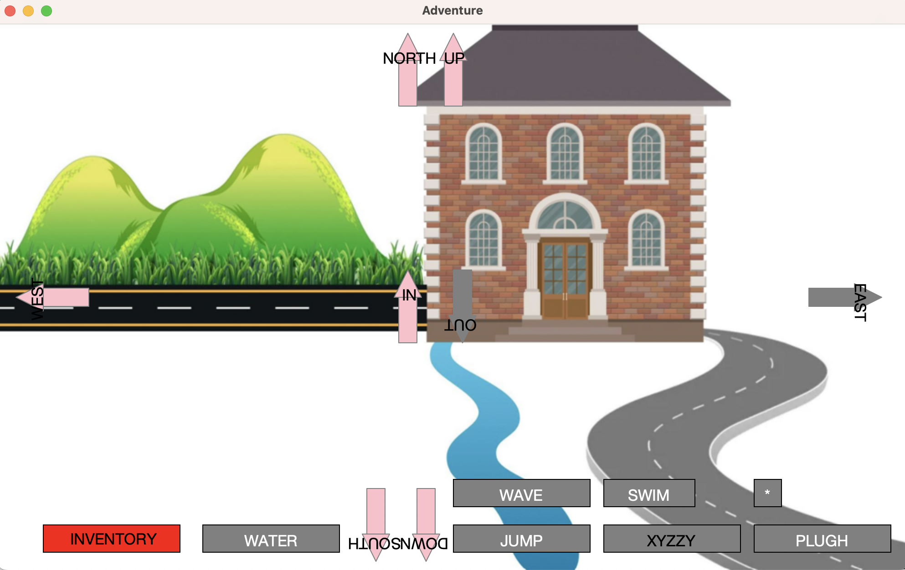

# Course Projects List
This repository contains projects that demonstrate my programming expertise ranging from classic games to cryptographic systems.
## 1. Adventure Game
- A text-based game where the player navigates through a series of rooms given room descriptions and collects objects along the way. For each room that you enter, the interface shows you an image of the room so you can better visualize your adventure. The interface shows all possible directions you can move in with arrows on the screen:
- If an arrow is gray, that is not a valid passage for this room. If an arrow is pink, that is a valid passage, and you can type the corresponding direction into the terminal to move
- There are various action words for different rooms such as "WATER", "WAVE", "JUMP", etc. which appear as buttons at the bottom of the interface
- Some rooms have objects hidden within them which are depicted in the interface for that room. If you see an object that you want to collect, click on it, and it will disappear from the room, becoming part of your inventory. To view the objects in your inventory, click on the inventory button in the interface. If you want to drop an object in your inventory, open your inventory, click on the object, then click somewhere else in the window to drop it
- If you prefer the terminal, you can type in "TAKE" or "DROP" to interact with the objects. Type "INVENTORY" to see what objects you're carrying, "LOOK" to reprint a detailed description of where you are, or "QUIT" to end your adventure.

 

  

## 2. Breakout Game
- Arcade-style Breakout game where the player uses a paddle to control the movement of a ball and hit bricks
- Player is allowed three tries
- Player wins when all bricks are hit with the ball

 

  

## 3. Enigma Machine
- An implementation of the Enigma machine, a cipher device used during World War II. The simulation encrypts and decrypts messages, making it difficult to crack codes

 

 

## 4. Flutterer
- Social network that mirrors the design of Twitter using client (JavaScript) and server (Python) programming
- Home page displays floots ("tweets") made by the user and their friends and allows for communication between floots

 

  

## 5. Generate Random Sentences
- Creates random sentences from a context-free grammar to form poems and other statements
## 6. Match the Flag
- Game that challenges the user to match flags from memory

 

  

 

  

 

 

## 7. Reassemble Fragments
- Reconstructs words from fragmented text by finding overlapping fragments
- Engineered and optimized to efficiently handle large text files
- Useful for data recovery, genomic sequencing, natural language processing, etc.
## 8. Wordle
- Implementation of the popular New York Times game Wordle where a player is given six attempts to guess a five-letter word
- The feedback (tile colors) from each guess provides the player with information to improve their guesses

 

  

